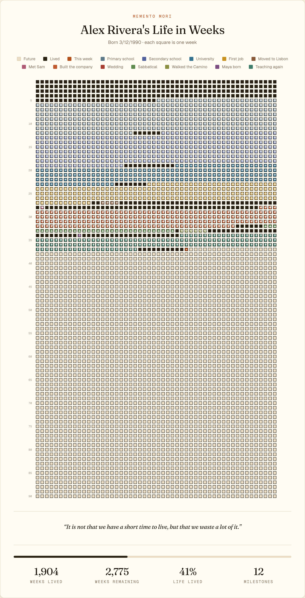
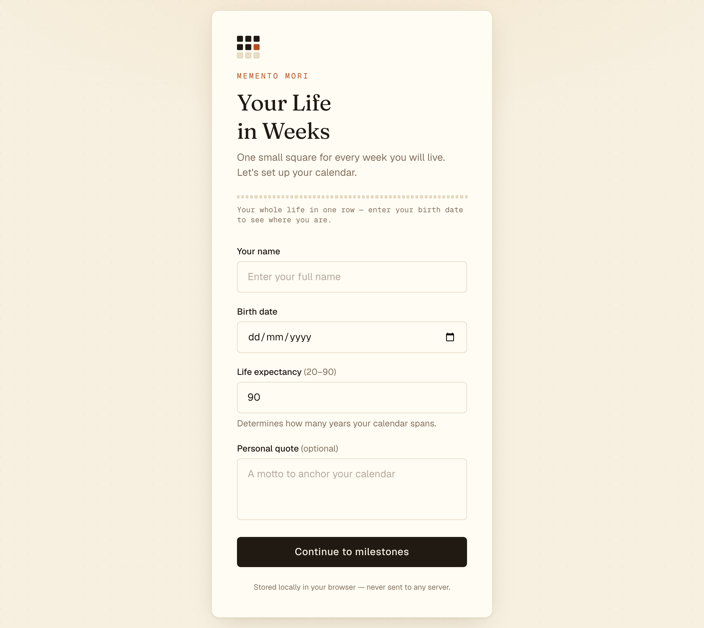
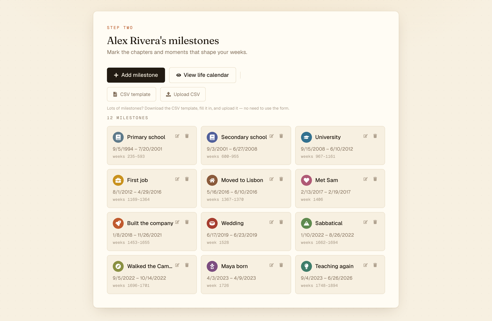
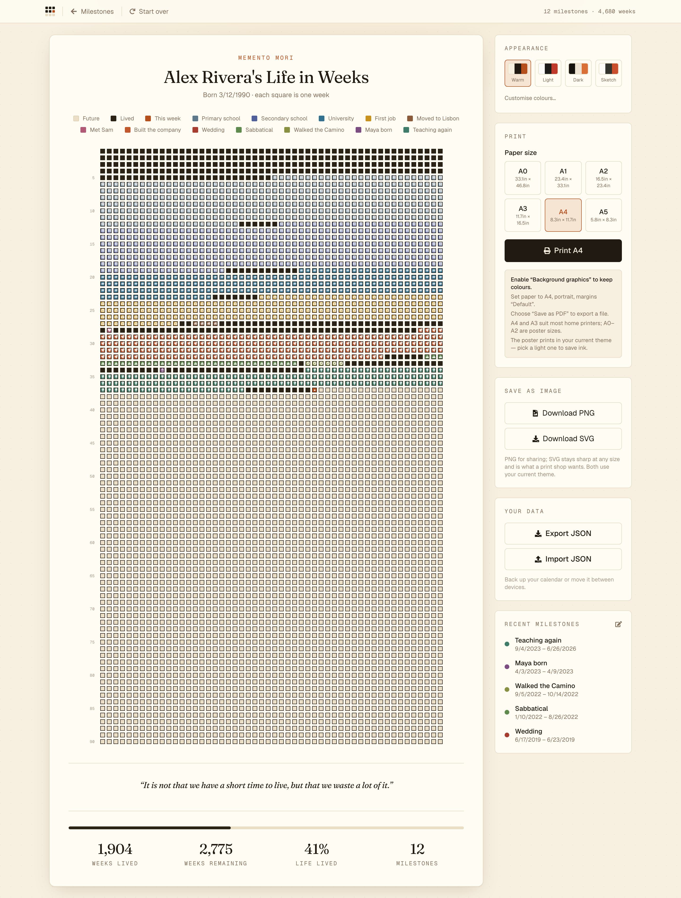
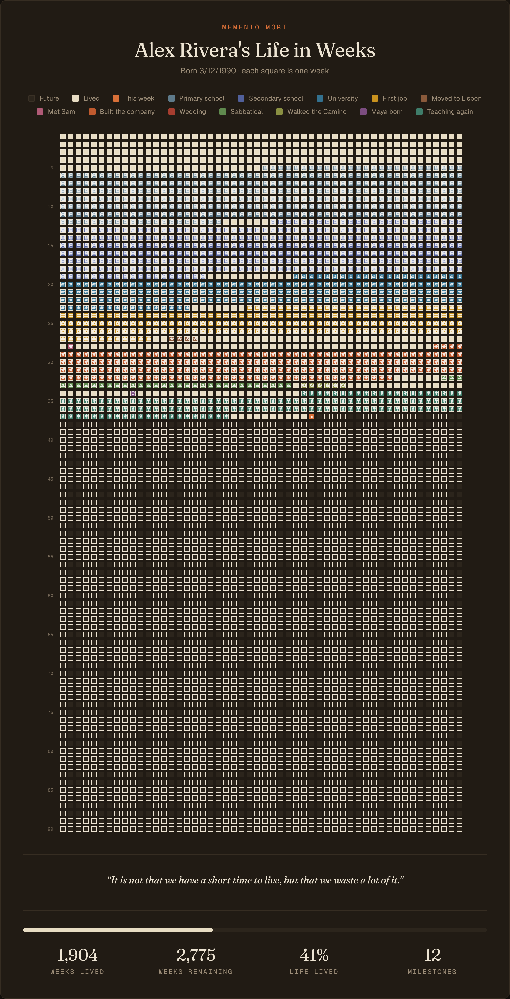

<h1 align="center">Your Life In Weeks</h1>

<p align="center">
  A printable calendar of every week of your life — one square per week, from
  the day you were born to the day you choose to stop counting.
</p>

<p align="center">
  <a href="#license"></a>
  <a href="https://github.com/isstiaung/yliw/actions/workflows/ci.yml"></a>
  
  
</p>

---

A life of 90 years is about 4,700 weeks. Drawn at one small square each, the
whole thing fits on a single sheet of paper — which turns out to be a very
different experience from reading the number. Fill in the weeks you have lived,
mark the chapters that mattered, and print it at poster size for the wall.

Inspired by Tim Urban's [*Your Life in Weeks*](https://waitbutwhy.com/2014/05/life-weeks.html).

<p align="center">
  
</p>

## Highlights

- **Everything stays on your device.** No account, no server, no analytics, no
  network calls. Your data lives in `localStorage` and nowhere else.
- **Built for printing.** Six paper sizes from A5 to A0, each with box sizes
  tuned so a full 52 × 90 grid fits one page with room for the title, legend,
  and stats.
- **Milestones as colour blocks.** Give an event a date range, a colour, and an
  icon; it paints across the weeks it spans.
- **Bulk import.** Paste your life in from a CSV instead of typing 40 events by
  hand. Malformed rows are reported per-row and skipped rather than failing the
  whole file.
- **Four themes, fully recolourable.** Warm, Light, Dark, and Sketch presets,
  plus per-token colour overrides for background, ink, accent, and each of the
  three week states.
- **Export as PNG or SVG.** Share it as an image, or hand a print shop a real
  vector that stays sharp at any size. Both use your current theme.
- **Fits any screen.** The whole 90-year grid is visible on a phone — no
  sideways scrolling to reach the last decade.
- **Portable data.** Export and import the whole calendar as JSON.

## Screens

<table>
  <tr>
    <td width="50%">
      
      <p align="center"><em>Setup — four fields, stored only in your browser</em></p>
    </td>
    <td width="50%">
      
      <p align="center"><em>Milestones — add by hand or upload a CSV</em></p>
    </td>
  </tr>
  <tr>
    <td width="50%">
      
      <p align="center"><em>The calendar, with print and theme controls</em></p>
    </td>
    <td width="50%">
      
      <p align="center"><em>The same poster in the dark theme</em></p>
    </td>
  </tr>
</table>

> Screenshots use a fictional persona — no real data here.

## Quick start

Requires **Node.js 22+**.

```bash
git clone https://github.com/isstiaung/yliw.git
cd yliw
npm install
npm run dev
```

Open <http://localhost:3000>.

## How it works

The app moves through three phases, held in a single reducer
(`src/contexts/LifeDataContext.tsx`):

1. **Setup** — your name, birth date, how many years to draw, and an optional
   quote for the footer.
2. **Events** — add milestones by hand, or upload a CSV. Dates are validated
   against your birth date and chosen end age.
3. **Calendar** — the grid itself, at `/calendar`, with the print panel.

Week numbering is computed from your birth date rather than the ISO calendar,
so week 1 is the week you were born (`src/utils/dateCalculations.ts`). The grid
renders one row per year of life and one column per week within that year.

### The CSV format

Only `title` and `start_date` are required. `end_date` defaults to
`start_date` for single-week events, blank colours are auto-assigned from the
palette, and unrecognised icons fall back to a default. Column headers accept
common aliases (`event`/`name` for `title`, `from`/`start` for `start_date`,
and so on). You can download a filled-in template from inside the app.

```csv
title,start_date,end_date,color,icon
University,2010-09-01,2014-06-15,#33718f,Graduation
First job,2014-07-01,2018-03-31,#c9921e,Briefcase
Wedding day,2019-05-18,,#a63d2f,Marriage
Trip to Japan,2022-04-02,2022-04-16,,Plane
```

### Exporting and printing

**Save as image** produces a PNG for sharing or an SVG for print. The SVG is
generated from the week data rather than screenshotted, so it is a true vector
— a few hundred KB that scales to a wall poster without softening.

For paper, pick a size in the print panel and hit print. Two things matter for a good
result: enable **Background graphics** in the browser print dialog, or every
square comes out white; and remember the poster prints in whatever theme is
active, so a light theme will save a lot of ink. A4 and A3 suit home printers;
A0–A2 are for a print shop.

## Project layout

```
src/
├── app/
│   ├── page.tsx           # Setup → events phase switch
│   ├── calendar/page.tsx  # The grid
│   ├── layout.tsx         # Fonts, theme bootstrap, data provider
│   └── globals.css        # Theme presets as CSS variable sets
├── components/            # Grid, forms, controls, icon picker
├── contexts/
│   └── LifeDataContext.tsx  # Single reducer + localStorage persistence
├── types/
└── utils/                   # Pure logic; *.test.ts sits beside each module
    ├── dateCalculations.ts  # Birth-relative week maths
    ├── csv.ts               # CSV parse + per-row validation
    ├── icons.ts             # Milestone icon catalogue + name lookup
    ├── posterExport.ts      # Poster as SVG, and SVG rasterised to PNG
    ├── printStyles.ts       # Per-paper-size @media print rules
    ├── themes.ts            # Theme presets, init script, external store
    ├── localStorage.ts      # Save/load/export/import
    └── eventColors.ts
```

Themes are defined as CSS variable sets under `[data-theme=…]` in
`globals.css`; `themes.ts` only drives the picker UI. A small inline script in
`layout.tsx` applies the saved theme before hydration so there is no flash of
the default palette — if you change one, keep the other in sync.

## Scripts

| Command             | What it does                                  |
| ------------------- | --------------------------------------------- |
| `npm run dev`       | Dev server at <http://localhost:3000>         |
| `npm run build`     | Static export to `out/`                       |
| `npm run start`     | Serve a production build                      |
| `npm run lint`      | ESLint                                        |
| `npm run typecheck` | TypeScript, no emit                           |
| `npm test`          | Vitest, once                                  |
| `npm run test:watch`| Vitest, watch mode                            |

## Deploying

The app is configured for [static export](https://nextjs.org/docs/app/guides/static-exports)
(`output: "export"` in `next.config.ts`), because it is entirely client-side.
`npm run build` produces a plain HTML/CSS/JS bundle in `out/` that you can drop
on any static host — Cloudflare Pages or Workers, Netlify, Vercel, GitHub
Pages, or an S3 bucket. There is nothing to configure and no environment
variables to set.

## Built with

[Next.js 16](https://nextjs.org) (App Router) · [React 19](https://react.dev) ·
[TypeScript](https://www.typescriptlang.org) ·
[Tailwind CSS 4](https://tailwindcss.com) ·
[date-fns](https://date-fns.org) · [react-icons](https://react-icons.github.io/react-icons/)

## Contributing

Contributions are welcome — see [CONTRIBUTING.md](CONTRIBUTING.md) for setup,
conventions, and what makes a PR easy to merge. Everyone taking part is
expected to follow the [Code of Conduct](CODE_OF_CONDUCT.md).

Good places to start: more icons, additional theme presets, keyboard navigation
for the grid, and further export formats such as ICS.

To report a security issue, please follow [SECURITY.md](SECURITY.md) rather
than opening a public issue.

## License

[MIT](LICENSE) © Sainath
